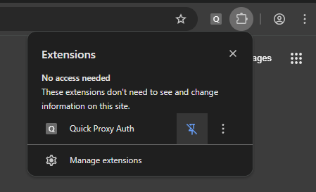
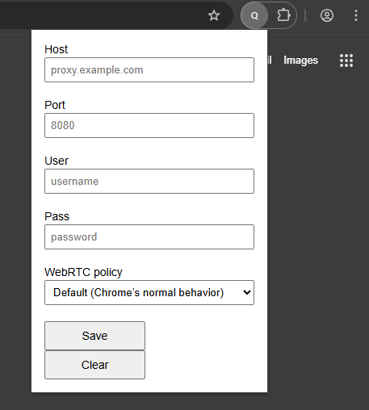

# chrome-quick-proxy

Allows you to manage proxy, WebRTc and cookies from the toolbar. Supports username and password authentication for proxies.

Har file entries are expected to have a `cookies` key with an array of cookies on both the request and response.

